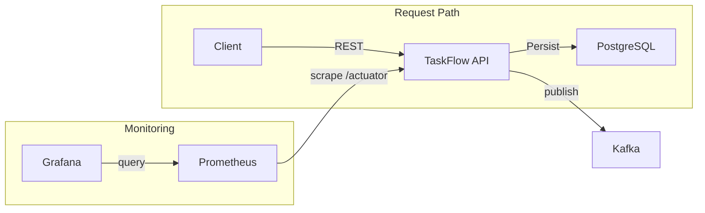
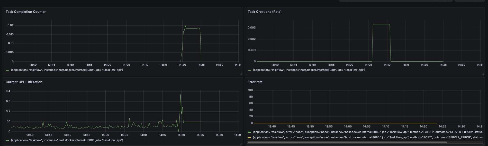
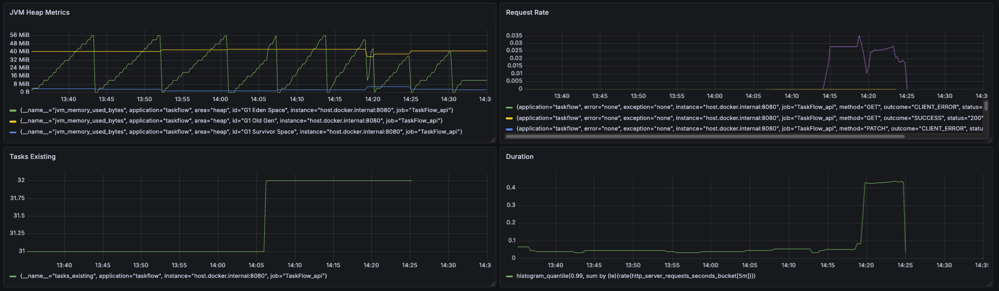

# TaskFlow — Cloud-Native Task Management API

> Event-driven REST API with Kafka streaming, Prometheus/Grafana observability,
> and full Docker Compose orchestration. Built with Java 17 and Spring Boot 3.



## Architecture Decisions

### Event-Driven Design (Kafka)
Task lifecycle events are published to Kafka so the API returns immediately to the client without waiting for downstream event processing.
Only upon consumption of the event is `Acknowledgment.acknowledge()` triggered, preventing acknowledgment of events that
might not have been fully processed, as could occur with auto-ack. The DLQ is configured to retry 3 times before routing to
the dead letter topic, allowing multiple attempts to process the event but falling back to logging it in case of failure.

### Observability (Prometheus + Grafana)
TaskFlow is decoupled from Prometheus, so the monitoring layer can be swapped, scaled, or removed without any changes to TaskFlow.
The Grafana dashboard uses the RED method — Request rate, Error rate, and p99 Duration — to surface the three ways a service
fails in production: overload, broken responses, and degraded latency. HTTP-level metrics can't track service-specific data.
Creation and completion rates track utilization and interaction, while the live task count tracks whether data is
accumulating or stagnating.

### Containerization
Multi-stage Dockerfile producing a 169MB image that deploys faster and minimizes the attack surface by excluding build tools
from production. Plain `depends_on` only checks if a container has started, whereas a healthcheck-gated `depends_on` confirms
the service is healthy before starting.

## Observability




The Grafana dashboard monitors TaskFlow using the RED method and custom business metrics:

- **Request Rate** — inbound HTTP requests per second
- **Error Rate** — percentage of responses returning 4xx/5xx
- **p99 Duration** — worst-case latency experienced by 99% of requests
- **Task Creation Counter** — total tasks created over time
- **Task Completion Counter** — total tasks completed over time
- **Existing Tasks Gauge** — current live task count in the database

Prometheus scrapes metrics from the `/actuator/prometheus` endpoint every 15 seconds.
Alert rules trigger when the error rate exceeds the configured threshold.

## Tech Stack

| Concern        | Technology                                              |
|----------------|---------------------------------------------------------|
| Runtime        | Java 17, Spring Boot 3.5.6, Spring Security, JWT (jjwt) |
| Persistence    | PostgreSQL 15, Spring Data JPA / Hibernate              |
| Messaging      | Apache Kafka (KRaft mode), Spring Kafka                 |
| Observability  | Prometheus, Grafana, Micrometer                         |
| Infrastructure | Docker (multi-stage build), Docker Compose              |

## Deployment

AWS deployment (ECS Fargate + RDS PostgreSQL) and CI/CD pipeline documentation coming soon.

## Features

- Full CRUD operations for task management
- RESTful API design with proper HTTP methods
- DTO pattern (separation of API and database layers)
- Request validation with custom error messages
- PostgreSQL database integration
- Layered architecture (Controller → Service → Repository)
- Auto-timestamping (createdOn, updatedOn)
- Environment-based configuration
- JWT authentication and role-based endpoint protection
- BCrypt password hashing
- Global exception handling
- Event-driven architecture with Kafka (producer, consumer, DLQ)
- Prometheus + Grafana observability with custom business metrics
- Multi-stage Docker build with health-gated orchestration

## Architecture Diagram
```
com.taskflow/
├── auth/
│   ├── controller/
│   │    └── AuthController.java
│   ├── dto/
│   │    ├── AuthResponse.java
│   │    ├── LoginRequest.java
│   │    └── RegisterRequest.java
│   └── service/
│        └── AuthService.java
├── common/
│   ├── exception/
│   │    ├── ErrorResponse.java
│   │    ├── GlobalExceptionHandler.java
│   │    └── TaskNotFoundException.java
│   └── util/
│       └── JwtUtil.java
├── messaging/
│   ├── KafkaConfig.java
│   ├── TaskEvent.java
│   ├── TaskEventAction.java
│   ├── TaskEventConsumer.java
│   └── TaskEventProducer.java
├── security/
│   ├── JwtAuthenticationFilter.java
│   └── SecurityConfig.java
├── task/
│   ├── web/
│   │   ├── TaskController.java      # REST endpoints
│   │   └── dto/
│   │       ├── CreateTaskRequest.java
│   │       ├── UpdateTaskRequest.java
│   │       └── TaskResponse.java
│   ├── service/
│   │   └── TaskService.java         # Business logic
│   ├── persistence/
│   │   ├── TaskEntity.java          # JPA entity
│   │   └── TaskRepository.java      # Data access
│   └── mapper/
│       └── TaskMapper.java          # DTO ↔ Entity conversion
├── user/
│   ├── persistence/
│   │   ├── UserEntity.java
│   │   └── UserRepository.java
│   └── service/
│      └── UserDetailsServiceImpl.java
└── TaskflowApiApplication.java      # Application entry point
```

## Roadmap

### Completed
- [x] PostgreSQL integration
- [x] DTO pattern implementation
- [x] JWT authentication & authorization
- [x] User entity and registration
- [x] Input validation
- [x] Exception handling with @ControllerAdvice
- [x] Docker containerization (multi-stage build + Docker Compose)
- [x] Apache Kafka integration (event-driven architecture)
- [x] Observability (Prometheus + Grafana metrics, alert rules)

### Upcoming
- [ ] AWS deployment (ECS Fargate + RDS)
- [ ] CI/CD pipeline (GitHub Actions)
- [ ] Load testing (k6)
- [ ] API documentation (Swagger/OpenAPI)

## Getting Started

<details>
<summary>Quick Start</summary>

### Prerequisites

- Docker and Docker Compose
- Java 17 or higher (for local development)
- Maven 3.6+ (for local development)

### Run with Docker Compose

```bash
# Clone the repository
git clone <your-repo-url>
cd taskflow-api

# Set your JWT secret
export JWT_SECRET=your-base64-encoded-secret-here

# Start all services (API, PostgreSQL, Kafka, Prometheus, Grafana)
docker compose up --build
```

The API will be available at `http://localhost:8080`, Grafana at `http://localhost:3000`, and Prometheus at `http://localhost:9090`.

### Local Development (without Docker)

1. Install and start PostgreSQL:
```bash
brew install postgresql@14
brew services start postgresql@14
```

2. Create database and user:
```bash
psql -U postgres

CREATE DATABASE taskflow;
CREATE USER taskflow_user WITH PASSWORD 'taskflow_password';
GRANT ALL PRIVILEGES ON DATABASE taskflow TO taskflow_user;
\q
```

3. Configure environment:
```bash
cp .env.example .env
# Edit .env with your database credentials
```

4. Build and run:
```bash
mvn clean install
mvn spring-boot:run
```

</details>

## Reference

<details>
<summary>API Reference</summary>

### Authentication

| Method | Endpoint             | Description       |
|--------|----------------------|-------------------|
| POST   | `/api/auth/register` | Register new user |
| POST   | `/api/auth/login`    | Login as user     |

### Task Management

**All task endpoints require a Bearer token.**

| Method | Endpoint             | Description            |
|--------|----------------------|------------------------|
| GET    | `/api/tasks`         | Get all tasks          |
| GET    | `/api/tasks/{id}`    | Get task by ID         |
| POST   | `/api/tasks`         | Create new task        |
| PUT    | `/api/tasks/{id}`    | Replace existing task  |
| PATCH  | `/api/tasks/{id}`    | Partially update task  |
| DELETE | `/api/tasks/{id}`    | Delete task            |

### Example Requests

**Register:**
```bash
curl -X POST http://localhost:8080/api/auth/register \
  -H "Content-Type: application/json" \
  -d '{
    "username": "username",
    "password": "password",
    "email": "username@gmail.com"
  }'
```

**Login:**
```bash
curl -X POST http://localhost:8080/api/auth/login \
  -H "Content-Type: application/json" \
  -d '{
    "username": "username",
    "password": "password"
  }'
```

**Create Task:**
```bash
curl -X POST http://localhost:8080/api/tasks \
  -H "Content-Type: application/json" \
  -H "Authorization: Bearer <token>" \
  -d '{
    "title": "Complete project",
    "description": "Finish the Spring Boot API",
    "status": "In Progress",
    "priority": 1,
    "assignee": "Jamie"
  }'
```

**Get All Tasks:**
```bash
curl http://localhost:8080/api/tasks \
  -H "Authorization: Bearer <token>"
```

**Update Task Status (PATCH):**
```bash
curl -X PATCH http://localhost:8080/api/tasks/1 \
  -H "Content-Type: application/json" \
  -H "Authorization: Bearer <token>" \
  -d '{"status": "Completed"}'
```

### Response Format

```json
{
  "id": 1,
  "title": "Complete project",
  "description": "Finish the Spring Boot API",
  "status": "In Progress",
  "assignee": "Jamie",
  "deadline": null,
  "priority": 1,
  "createdOn": "2025-11-05T13:17:01.710206",
  "updatedOn": null
}
```

### Validation Rules

- `title`: Required, max 1000 characters
- `description`: Optional, max 1000 characters
- `status`: Optional, max 50 characters
- `assignee`: Optional, max 100 characters
- `priority`: Optional, minimum value 1

</details>

<details>
<summary>Environment Variables</summary>

| Variable                         | Description                      | Default                                     |
|----------------------------------|----------------------------------|---------------------------------------------|
| `DB_URL`                         | PostgreSQL connection URL        | `jdbc:postgresql://localhost:5432/taskflow` |
| `DB_USERNAME`                    | Database username                | `taskflow_user`                             |
| `DB_PASSWORD`                    | Database password                | `taskflow_password`                         |
| `JWT_SECRET`                     | Secret key for signing JWTs      | (none — must be set)                        |
| `JWT_EXPIRATION`                 | Token expiration in milliseconds | `86400000`                                  |
| `SPRING_KAFKA_BOOTSTRAP_SERVERS` | Kafka broker address             | `localhost:9092`                            |

</details>

<details>
<summary>Load Testing Results</summary>

Load testing results (p50/p95/p99 latency, throughput) coming soon.

</details>

---

**Jamie Marini-Loebe** — [LinkedIn](https://www.linkedin.com/in/jamiemariniloebe/) · [GitHub](https://github.com/JamieMariniLoebe) · jamie.loebe2@gmail.com
Re